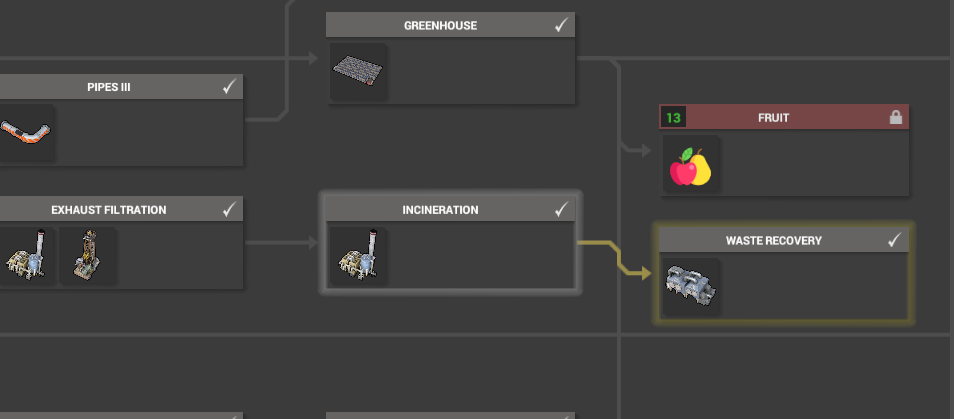

# WasteManagement
## Version 1.0.4 (compatible CoI version: 0.4.12 - 0.4.13)

Provides various waste management buildings to the game.

Currently provides:
* Incineration Plant

More may come... please create an issue for any suggestions or bugs.

# How to install

Download the latest release: https://github.com/NotoriousPyro/WasteManagement/releases

1. From the downloaded zip, copy the contents of the `Mods` folder to your Captain of Industry `Mods` folder.

    By default, this is `Documents\Captain of Industry\Mods`. You can find out where exactly by running the following in PowerShell:
    ```powershell
    ((new-object -COM Shell.Application).Namespace(0x05).Self.Path + '\Captain of Industry\Mods')
    ```

2. Verify inside 'Mods' folder, each sub-folder has **a dll file with the same name as the folder**, it is fine if other DLLs are also present.

3. Enable the `Enable mods` options in the ingame settings or select the mod in load game menu.

# How to use

## Basic setup


## Research
* **Incineration plant**: dependant on Exhaust Filtration first being completed.
* **Waste recovery plant**: dependant on Incineration plant first being completed.


## Recipes
* Incineration plant

